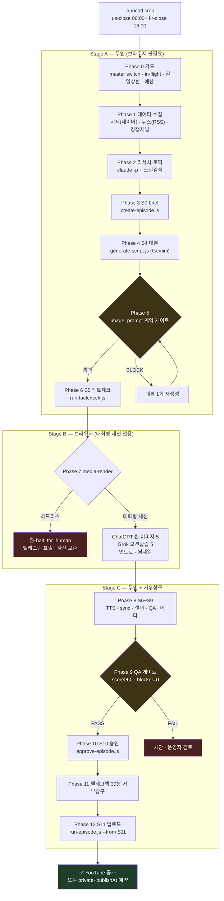

# BarroTube 에피소드 생성 흐름도

`barrotube` 스킬이 신규 에피소드를 만들어 YouTube에 올리기까지의 실제 흐름.
**설계도가 아니라 2026-07-29~31 실제 운영에서 관측한 것**을 기준으로 적었다.
동작하지 않는 구간은 [[#막혀 있는 구간]]에 그대로 남겼다.

관련: [[barrotube-reels-pipeline|Reels 파이프라인]] ·
[[barrotube-media-render-automation-plan|Media Render 자동 운영 계획]]

## 한눈에



## 왜 3단으로 나뉘는가

핵심 제약 하나가 구조를 결정한다. **이미지·영상은 로그인된 브라우저로만 만든다**
(`config/image-engines.json`의 `S6c_scene`·`S6d_intro`·`S6e_thumbnail` = `media-render`).
Gemini·gpt-image-1 같은 이미지 API는 쓰지 않는다.

그래서 브라우저가 필요한 구간(Stage B)만 떼어내고, 앞뒤는 무인으로 돌린다.

| 단계 | 브라우저 | 비용 | 실패 시 |
|---|---|---|---|
| **A** 데이터→대본 | 불필요 | 거의 0 | 버리고 다시 하면 그만 |
| **B** 이미지·영상 | **필수** | 사람 시간 | 자산 보존 후 대기 |
| **C** 렌더→발행 | 불필요 | TTS ≈ $0.21 | QA·승인·거부창구가 막음 |

**계약 게이트(Phase 5)를 Stage A 끝에 두는 이유**: 어긋난 프롬프트로 이미지를 구우면
이미지 비용 + Grok 클립 재생성까지 딸려온다(EP-2026-0070 실사례). 굽기 **전에** 막는다.

## 단계별 실제 명령

```text
Phase 1  fetch-market-snapshot.js --slot <slot>     # 네이버 증권, 키 불필요
         fetch-daily-news.js --sources <슬롯별>      # RSS 10종 중 선택
         fetch-competitor-stats.js                  # ⚠ 현재 크래시 (아래 참조)
Phase 2  research-brief.js --slot <slot>            # claude -p, 소셜검색
Phase 3  create-episode.js --channel econ-daily --topic "…"
Phase 4  generate-script.js --episode <dir> --platform shorts
Phase 5  validate-image-prompts.js --episode <dir>  # 0=통과 1=BLOCK 2=입력오류
Phase 6  run-factcheck.js --episode <EP> --platform shorts
Phase 7  barrotube-media-render 스킬 (대화형 세션)
Phase 8  produce-episode.js --episode <dir> --platform shorts --execute
Phase 10 approve-episode.js --episode <EP> --platform shorts --by <who>
Phase 12 run-episode.js --episode <EP> --from S11
```

> `produce-episode.js`는 `--execute` 없이 부르면 **dry-run**이다(2026-07-29 신설).
> `run-episode.js`는 `--execute`가 아니라 `--dry-run`을 받는다 — 반대다.

## 슬롯

`config/routines.json`이 두 루틴의 차이만 선언한다.

| 슬롯 | 시작 | 공개 | 뉴스 소스 | 경쟁채널 |
|---|---|---|---|---|
| `us-close` | 06:00 | 08:00 | cnbc · yahoo · ft · investing | O |
| `kr-close` | 16:00 | 18:00 | naver · yna · bok · mk | X |

launchd `StartCalendarInterval`이 단일 dict라 **하루 2회는 라벨을 나눠야 한다**.
라벨: `com.barroskills.barrotube.<slot>`.

## 막혀 있는 구간

관측된 사실만 적는다. 추정은 표시했다.

### 1. Stage B는 헤드리스로 절대 성공하지 않는다 — 구조적

`claude -p` 하위 세션에 **브라우저 도구가 없다**. 3회 재현했다.

- Playwright MCP / `chrome:control-chrome` **둘 다 부재** (붙는 MCP는 Gmail·Calendar·Drive·Notion·codex)
- 파일시스템 샌드박스가 `~/Downloads`·스킬 `scripts/`·`/Applications`를 차단.
  `media_render_doctor.py --help`조차 거부됨
- 판정까지 60~80초

EP-2026-0074는 이걸 모른 채 **2400초(40분)를 태우고** 멈췄다.
2026-07-30에 즉시 halt로 고쳤다(**31초**). 헤드리스 시도는 `BT_TRY_HEADLESS_MEDIA=1`로만.

> 환경 문제가 아니다 — launchd PATH·cwd·stdin(EOF 없음)을 모두 재현했지만
> `claude -p`는 5~10초에 정상 응답했다.

### 2. 경쟁 채널 수집이 매 실행 크래시 — 죽은 경로

```text
✗ Invalid or missing policy (expected v2.0):
    …/barrotube/paperclip/config/competitor-channels.json
  at resolveCompetitorChannels (resolve-competitor-channels.js:105)
```

`resolve-competitor-channels.js:32-33`이 **제거된 `paperclip/`**를 본다.
실제 파일은 `config/competitor-channels.json`에 있고 `version: "2.0"`까지 충족한다.
**경로 두 줄만 틀렸다.**

auto-pipeline이 비치명으로 처리해 조용히 넘어가므로, 리서치 문서에는
"파일이 존재하지 않아 비교 불가"라는 **결과만** 남는다(EP-2026-0074·0076 동일).

고쳐도 2차 관문이 있다: 채널 목록을 마케팅 리포트에서 파싱하는데
`source_dir`에 **2026-04-27자 1건**뿐이고 `max_age_days`는 30이다 → 여전히 빈손.

### 3. 팩트체크 grounding이 자주 꺼진다

Gemini가 `google_search` 호출을 거부하면 **모델 지식만으로** 판정한다.
당일 사건은 검증 자체가 불가능하다. EP-0072·0073·0074에서 반복 관측.

EP-2026-0073에서는 grounded 상태에서도 **장중가·전일 종가를 당일 종가로 착각**해
정상 수치 3건을 오탐했다. 1차 소스(네이버 실시간 + 일별 OHLC) 교차검증으로
반증하고 운영자 검토를 `35_factcheck.md`에 남겼다 — **기계 판정은 뒤집지 않았다.**

### 4. 계약 게이트가 승인된 스타일을 막는다

`image-prompt-contract.js`는 EP-2026-0069를 기준점으로 만들어졌다
(640~780자 · 프레임비율 금지 · 의상 금지). 그런데 운영자가 채택한 실제 스타일은
**EP-0070/0071**이다(990~1,165자 · `44-48% of frame height` · `Wardrobe:` 명시 ·
`cinematic … wide-angle 24mm`).

즉 **게이트가 원하는 산출물을 BLOCK한다.** EP-0073·0075는 게이트를 우회해 만들었다.
계약을 0070/0071 기준으로 다시 쓸지 결정이 필요하다.

### 5. 대본 길이 계산이 틀렸다

한국어 TTS 실측 **≈ 8.5자/초**(persona `barro-alert`, speed 1.05).
5.5자/초로 잡고 쓰면 60초 대본이 **43초**로 나온다(EP-2026-0075 실측 296자 → 35.8초).

- 60초를 채우려면 나레이션 **총 500자 이상**, 씬당 100자 안팎
- `sync-durations.js`가 `target_seconds`를 실측 TTS로 덮어쓰므로
  **QA는 이 편차를 못 잡는다**(실측 기준으로 비교하기 때문)

## 안전 가드

| # | 가드 | 근거 |
|---|---|---|
| 1 | master switch | `autonomy-pause.json` `status != active` → 종료 |
| 2 | 일일 EP 상한 | `max_episodes_per_day` (현재 **2**) |
| 3 | 월 예산 | roles 합계 $770의 90% = **$693**에서 차단 |
| 4 | in-flight 락 | EP 단위 직렬. **S11 발행 시 자동 해제** |
| 5 | 팩트체크 HIGH | 자동 회귀 최대 2회 |
| 6 | **계약 게이트** | 이미지 굽기 전 차단 |
| 7 | QA 게이트 | score ≥ 60 · blocker = 0 |
| 8 | 텔레그램 거부창구 | 30분 |
| 9 | 공인 정책 | Public Figure BLOCK은 자율 승인도 못 뚫음 |

> **락 주의**: S11을 돌지 않고 끝내면 락이 남아 다음 cron이 막힌다.
> `in-flight-lock.js release --episode <EP>`로 직접 풀어야 한다.

## 비용

media-render 경로는 이미지·영상을 브라우저로 만들어 **이미지 API 비용이 0**이다.

| 항목 | 편당 |
|---|---|
| TTS (ElevenLabs) | ≈ $0.21 |
| Gemini 텍스트 (대본·팩트체크·메타) | ≈ $0.01 |
| 이미지·영상 | **$0** |
| **합계** | **≈ $0.22** |

하루 2편 × 30일 ≈ **$13/월**. 2026-07 실지출 $2.31이 근거다.

## 실제 산출 경로

```text
workspace/episodes/EP-YYYY-NNNN/
  00_brief.md · 10_market_research.md · .episode_status.json
  platforms/shorts/
    30_script.md · 35_factcheck.md
    40_assets/images/scene_001..005.png     ← ChatGPT
    40_assets/videos/scene_001..005.mp4     ← Grok (필수, 5/5)
    40_assets/tts/
    45_intro.png · 47_thumbnail.png · 48_outro.png
    55_render/video.mp4
    60_qa_report.md · 70_publish_meta.json
    75_board_approval.json · 80_publish_result.json
```

## 참고 — 완주 사례

**EP-2026-0075** 「금리 동결의 의미」 (2026-07-30)
씬 5/5 · Grok 5/5 · 1080×1920 43.1초 · QA 전항목 통과 ·
<https://youtu.be/_6QlJTbV7mE> 공개 발행.

Stage B는 대화형 세션에서 수행했다. cron 단독으로는 여기까지 갈 수 없다.
